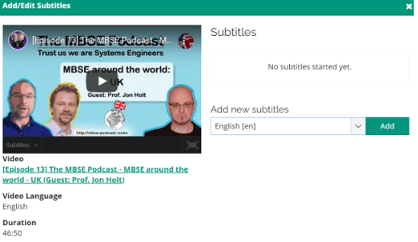
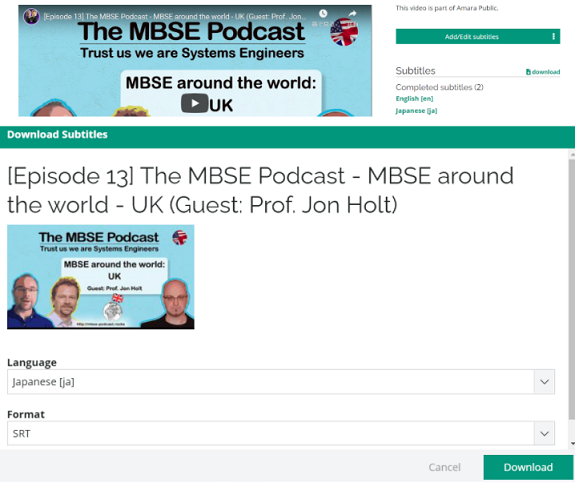

# Instruction - How To Create Translations
## MBSE Podcast videos for everyone!
 - For people who are hard of hearing MBSE Podcast
 - For people who are hard of understanding MBSE Podcast in original language

---

## How to create translations with [Amara](https://amara.org/en/)
Please create your account of [Amara](https://amara.org/en/).

You can find MBSE Podcast videos in Amara when you search the words “MBSE Podcast”.  
They are public videos in Amara Public where anyone can edit subtitles for videos.  
The videos in Amara Public are independent from the original ones in YouTube.  
Therefore, the added subtitles in Amara are not reflected in the YouTube videos.  

  

This instruction page consists of 4 chapters as below.  

| Chapter                                                                        | Content                                                                                                                                                                                                                                                                                                                                                                                        | 
| ------------------------------------------------------------------------------ | ---------------------------------------------------------------------------------------------------------------------------------------------------------------------------------------------------------------------------------------------------------------------------------------------------------------------------------------------------------------------------------------------- | 
| [0. Overvier](#0-overview)                                                     | This chapter shows the overview of how to create translations.                                                                                                                                                                                                                                                                                                                                 | 
| [1. Preparation](#1-preparation)                                               | This chapter shows the preparation to use Amara for this translation work. You can skip this chapter if you can find the target video in Amara Public.                                                                                                                                                                                                                                      | 
| [2. Add subtitles in original language](#2-add-subtitles-in-original-language) | This chapter shows how to add subtitles in original language (e.g. English subtitles for videos in English, German subtitles for videos in German, etc.). You can skip this chapter if the subtitles in the original language are completed.                                                                                                                                                | 
| [3. Add subtitles in other languages](#3-add-subtitles-in-other-languages)     | This chapter shows how to add subtitles in original language (e.g. Chinese subtitles for videos in English, Japanese subtitles for videos in German, etc.). This work should be based on the subtitles from [2. Add subtitles in original language](#2-add-subtitles-in-original-language) in order to keep a consistency with subtitles in original language and to translate efficiently. | 

---

### 0. Overview
Anyone in the world can contribute to the subtitle creation like open source software.  
When the subtitle creation is completed, it will be published.  
(Completion indicator on Amara Public)  

---

### 1. Preparation
#### 1.1. Add MBSE Podcast video to Amara Public
You can skip this chapter if you can find the target video in Amara Public.  
If you cannot find your target video, it is not registered in Amara Public yet.  
In this case, you should register the video to Amara Public.  

##### 1.1.1. Copy the URL of the YouTube video.

https://www.youtube.com/watch?v=yWKRQ3urLPI in this example  

##### 1.1.2. Press the “+ Add videos” button.

Paste the URL and select the original language of the video.  
The video is added to Amara Public if you press “Add to Amara Public”  

#### 1.2. Add auto-generated subtitles to MBSE Podcast videos in Amara Public
As a preparation for creating subtitles in the original language, it is better to import auto-generated subtitles in the original language.  

##### 1.2.1. Copy the URL of the YouTube video.

https://www.youtube.com/watch?v=yWKRQ3urLPI in this example  

##### 1.2.2. Download or clone 0xx_captions_xx-xx_original.srt file in this repository.

##### 1.2.3. Press the “Add/Edit subtitles” button of the target video in Amara Public.

##### 1.2.4. Select the original language and press the “Add” button.

##### 1.2.5. Press the “Upload subtitles” button.

##### 1.2.6. Select the downloaded SRT file and press “Upload”.
The subtitles in the SRT file are uploaded.

---

### 2. Add subtitles in original language
First of all, it is better to complete subtitles in the original language.  
That means this should be based on [1.2. Add auto-generated subtitles to MBSE Podcast videos in Amara Public](#12-add-auto-generated-subtitles-to-mbse-podcast-videos-in-amara-public))  

#### 2.1. Select “Add/Edit subtitles” of the target video in Amara Public.

#### 2.2. Select “Edit (original language)”.

#### 2.3. Edit subtitles.

**Hints for subtitles**
 - One sentence or one meaningful chunk in one block
 - Correct auto-generated translation (e.g. “cosy”->”INCOSE”, “sml”->”SysML”, etc.)
 - Remove “[Music]”
 - Remove meaningless phrases (e.g. “Ah”, “Well”, “You know”, etc.)
 - Remove meaningless repeats (e.g. “I I I mean”->“I mean”, “I think, I think”->“I think”)
 - Period (‘.’) and comma (‘,’) in the last of the sentence is not necessary.
 - Correct small characters to large for “I” (“i am”->”I am”), names (tim->Tim), etc. 
 - All warnings are corrected (Warnings are highlighted as orange color)
   - Subtitle line length
     - Keep subtitle length to about 42 characters.
     - Avoid more than 2 lines per subtitle.
   - Minimum duration
     - Subtitles should be at least 0.7 seconds.
   - Maximum duration
     - Split subtitles longer than 7 seconds.
   - Reading speed
     - Reading rate shouldn't exceed 21 characters / sec.

#### 2.4. Press “Save Draft” when you want to save your work.

If you select “(target language)”, you can check the revision.  

#### 2.5. Press “Publish” when the subtitle creation is completed.
After completing the subtitles and checking them, you can fix/publish the subtitles.

#### 2.6. Download SRT file from completed subtitles in original language.
Press the “download” button and select the SRT file.

#### 2.7. Push (git push) the SRT file into your forked GitHub repository and make a PR (Pull Request) 

---

### 3. Add subtitles in other languages
It is better to create subtitles in other languages based on the one in the original language.

#### 3.1. Press the “Add/Edit subtitles” button of the target video in Amara Public
If you find your target language, please go to “6. Edit subtitles”.  
If you do not find your target language, please go to “Select the target language and press the “Add” button”.  

#### 3.2. Select the target language and press the “Add” button. (Select Japanese as example)

#### 3.3. Download SRT file from completed subtitles in original language.  
Press the “download” button and select the SRT file.

#### 3.4. Press the “Upload subtitles” button.

#### 3.5. Select the downloaded SRT file and press “Upload”.
The subtitles in the SRT file are uploaded.

  

    

#### 3.6. Edit subtitles.

**Hints for subtitles**
 - One sentence or one meaningful chunk in one block
 - Correct auto-generated translation (e.g. “cosy”->”INCOSE”, “sml”->”SysML”, etc.)
 - Remove “[Music]”
 - Remove meaningless phrases (e.g. “Ah”, “Well”, “You know”, etc.)
 - Remove meaningless repeats (e.g. “I I I mean”->“I mean”, “I think, I think”->“I think”)
 - Period (‘.’) and comma (‘,’) in the last of the sentence is not necessary.
 - Correct small characters to large for “I” (“i am”->”I am”), names (tim->Tim), etc. 
 - All warnings are corrected (Warnings are highlighted as orange color)
   - Subtitle line length
     - Keep subtitle length to about 42 characters.
     - Avoid more than 2 lines per subtitle.
   - Minimum duration
     - Subtitles should be at least 0.7 seconds.
   - Maximum duration
     - Split subtitles longer than 7 seconds.
   - Reading speed
     - Reading rate shouldn't exceed 21 characters / sec.

#### 3.7. Press “Save Draft” when you want to save your work.

If you select “(target language)”, you can check the revision.  

#### 3.8. Press “Publish” when the subtitle creation is completed.
After completing the subtitles and checking them, you can fix/publish the subtitles.

#### 3.9. Download SRT file from completed subtitles in original language.
Press the “download” button and select the SRT file.

#### 3.10. Push (git push) the SRT file into your forked GitHub repository and make a PR (Pull Request) 
